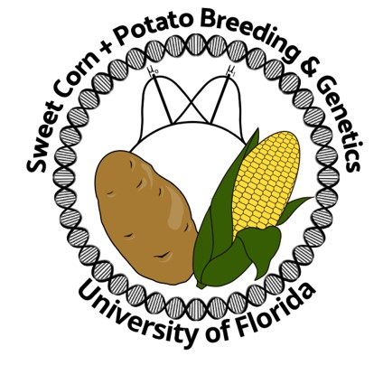

 

I am a passionate   and   enthusiastic   Genetics   and   Plant   Breeding   scientist. Experience with soybean breeding, molecular genetics and biotechnological applications, bioinformatics analysis, and high throughput phenotyping. I am currently a Ph. D. candidate working on Genomics and Bioinformatics at Dr. Resende`s lab, focusing on leveraging genetic diversity by exploring structural variants in the sweet corn population. My ultimate career goal is to contribute to research and technology development for plant breeding agriculture to improve human life and a sustainable world.

